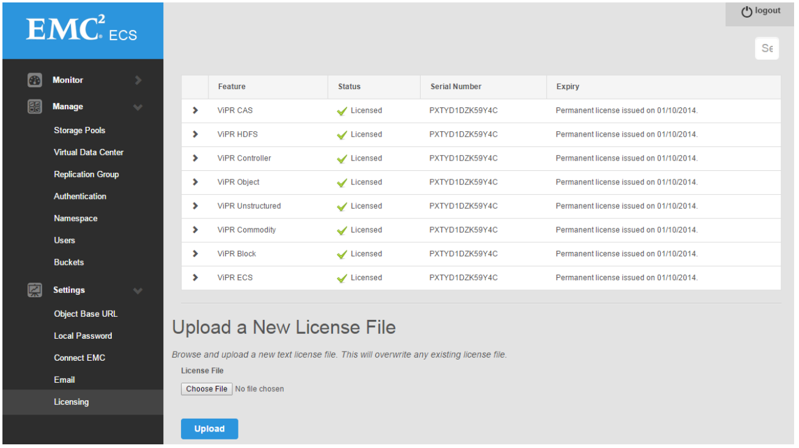
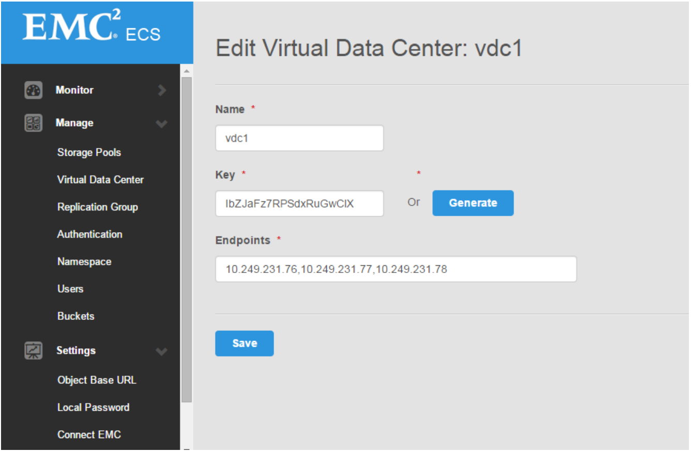
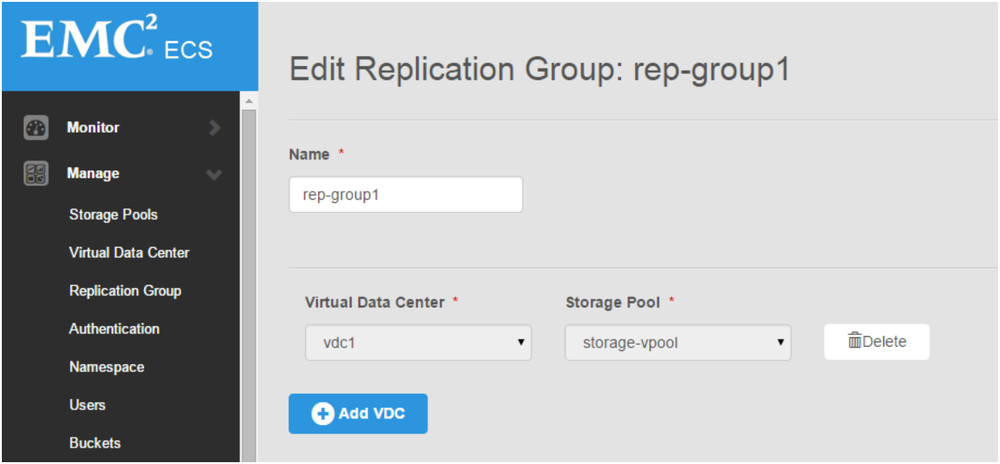
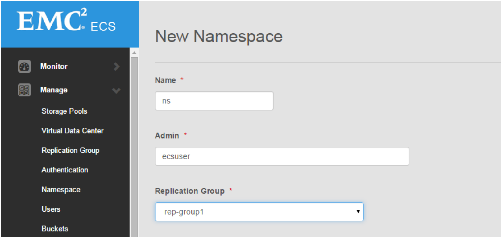
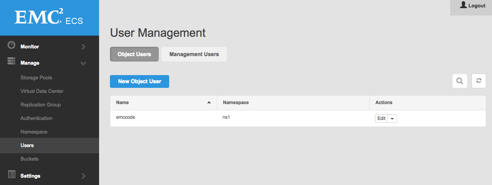
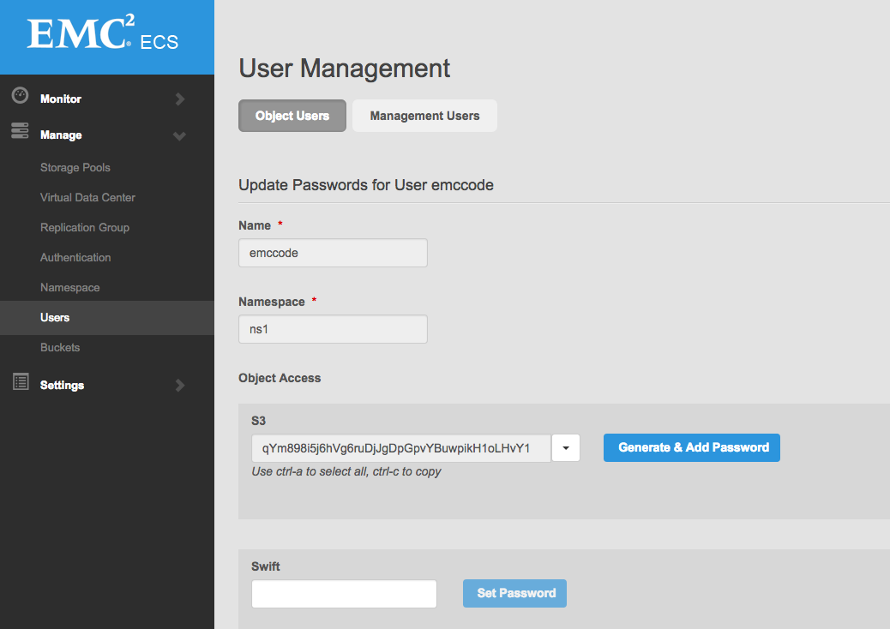

# ECS Administrative Web UI

## Login to the Web UI
The WebUI uses SSL and a self-signed certificate to help protect your session from casual eves-dropping. Take the IP of your first ECS node, fire up your browser, and point `https://` at it. For this example, the latest Google Chrome browser was used.

You cannot add, change, or remove administrative users in this build. Use the default below.

> Username: **root** Password: **ChangeMe**

## Input License

Open *Settings*, then *Licensing* and upload the `license.xml` file located in the ecs-single-node / ecs-multi-node folder. **The UI will not automatically update the license view in this release.** Navigating away from page and returning will prompt it to update. You may need to try a few times before it updates. Once it does, you should see something like this:

## Create Storage vPool

Open *Manage*, then *Storage Pools* and create a storage pool. Keep the name simple, and add all nodes to the pool. Click *Save*. 

There's a known issue in this build that causes the Storage Pools view to appear frozen for about 1-2 minutes after provisioning begins. **Unlike with the license view case, this view will update on its own.** Once it's updated, you should see something similar to:

## Create Virtual Data Center

Open *Manage*, then *Virtual Data Center* and create a Virtual Data Center using the below screenshot as a guide. **Please wait for up to 20 minutes after creating a Storage vPool before creating a Virtual Data Center.** There are several background tasks that must complete, and for object to fully initialize.

## Create Replication Group

Open *Manage*, then *Replication Group* and create a Replication Group using the below as an example. Currently only one VDC in a replication group is supported.

## Create Namespace

Open *Manage*, then *Namespace*. Set up a Simple Namespace with a name such as "ns". Input a namespace username to use with the namespace, such as "ecs_user". Select the replication group for the namespace, and click *Save* at the very bottom.

###### Namespace features available in this release

* &#x2714; Simple Namespace
* <del> Retention Policies </del>
* <del> Quotas </del>
* <del> Authentication Domains </del> 

## Create Object User Account

Open *Manage*, then *Users*, then click on *Object Users* and *New Object User* to set up object store credentials.

Create secrets by filling the fields and clicking the buttons.

* <b>S3 Key:</b> Click *Generate & Add Password* to retrieve the server-generated key.
* <b>Swift Password:</b> Enter your own password and click *Set Password*.

